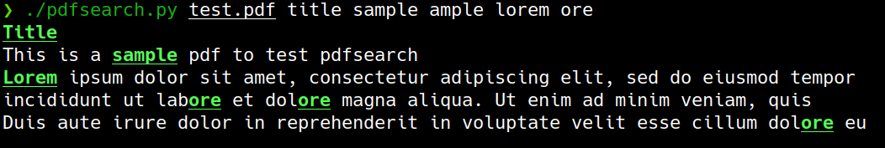

# PDFSEARCH

This is a CLI application to search pdf

# How to setup

```
sudo apt install libpoppler-cpp-dev
pip install -r requirements.txt
```

### How to use:

```
Usage: pdfsearch.py [OPTIONS] FILENAME QUERY...

Arguments:
  FILENAME  [required]
  QUERY...  [required]

Options:
  --ignorecase / --no-ignorecase  Ignore case for searching  [default:
                                  ignorecase]
  --exact / --no-exact            Match exact substring  [default: no-exact]
  --plain / --no-plain            Output plaintext without coloring, bolding
                                  and underlining  [default: no-plain]
  --processes INTEGER             Number of parallel processes  [default: 1]
  --install-completion [bash|zsh|fish|powershell|pwsh]
                                  Install completion for the specified shell.
  --show-completion [bash|zsh|fish|powershell|pwsh]
                                  Show completion for the specified shell, to
                                  copy it or customize the installation.
  --help                          Show this message and exit.
  ```

### An example:

```
./pdfsearch.py test.pdf title sample ample lorem ore
```


